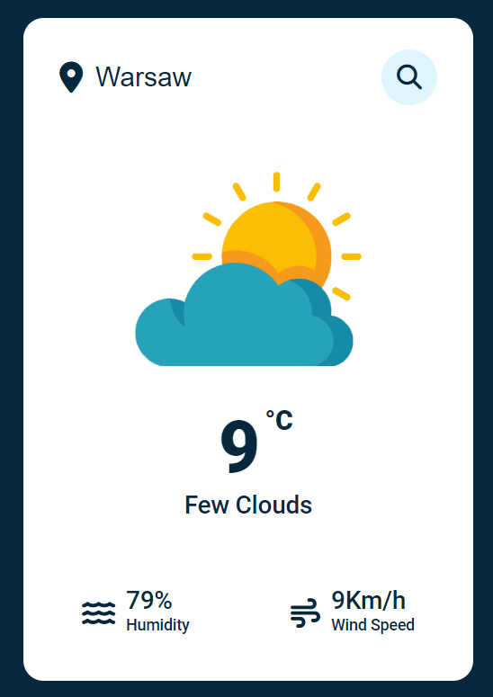

### Weather App
Here I am sharing how to code a Weather App with javascript, while using a weather API.

## Warning
You need to get your own API key and replace it in index.js file on line 9 :

```javascript
const APIKey = 'Your API Key';
```


# Screenshot
Here is a project screenshot :


